# Serverless


### IaaS (Infrastructure as a Service)

- AWS, Azure 등의 서비스가 만들어지기 시작하여 더 이상 서버자원, 네트워크, 전력 등의 인프라를 모두 직접 구축할 필요가 없어졌다. 이러한 `인프라를 가상화`하여 관리하기 쉽게 해주는 서비스 서비스를 통하여, 관리자 패널에서 인프라를 구성하고 사용하고. 사용자는 가상머신을 만들고, 네트워크를 설정하고, 하드웨어도 설정하고, 거기에 운영체제를 설치해서 애플리케이션을 구동할 수 있다. 또한 사용량을 쉽게 모니터링 할 수 있다.

### PaaS (Platform as a Service)

- IaaS 보다 더 추상화된 모델로써 `Network 및 Runtime 제공`이 된다. 사용자는 애플리케이션만 배포하면 바로 구동시킬 수 있는 서비스 이다. 대표적으로 AWS Elastic Beanstalk, Azure App Services 등이 있으며, 이를 사용하면 Auto Scaling 및 Load Balancing도 쉽게 적용 할 수 있다.

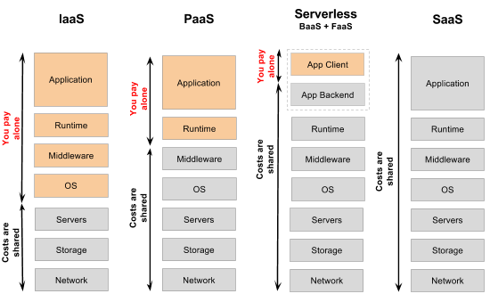

---

- Serverless는 서버가 없다는 의미로 보통 `Serverless Computing` 또는 `Serverless Architecture`로 불린다. Serverless 개념은 application 관점에서 `BaaS`와 `FaaS`로 나누어 살펴보면 이해가 더 용이하다.

[](https://martinfowler.com/articles/serverless.html)
[](https://hackernoon.com/what-is-serverless-architecture-what-are-its-pros-and-cons-cc4b804022e9)


### BaaS (Backend as a Service) - ex) Firebase

- 백엔드 서버 개발을 하다보면, 서버의 확장도 고려해야 하고, 보안성 또한 고려해야 하는데, 앱 개발에 있어서 필요한 다양한 기능들 (데이터베이스, 소셜서비스 연동, 파일시스템 등)을 API로 제공해 줌으로써, 개발자들이 서버 개발을 하지 않고서도 필요한 기능을 쉽고 빠르게 구현 할 수 있게 해주고, 비용은 사용 한 만큼 지불하는 형태의 서비스를 말한다.
- BaaS를 사용함으로서, 발생하는 대표적인 단점으로는 백엔드 로직들이 클라이언트쪽에 구현이 되며, 앱의 규모가 커질수록 비용이 들고, 복잡한 query가 불가능하다.


### FaaS (Function as a Service)

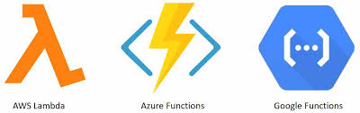

- FaaS는 프로젝트를 여러개의 함수로 쪼개서 (혹은 한개의 함수로 만들어서), 매우 거대하고 분산된 컴퓨팅 자원에 여러분이 준비해둔 함수를 등록하고, 이 함수들이 실행되는 횟수 (그리고 실행된 시간) 만큼 비용을 내는 방식을 말한다.
- 서버 시스템에 대해서 신경쓰지 않아도 된다는 점이 PaaS 와 유사하지만, PaaS 의 경우엔, `전체 Application`을 배포하며, 일단 어떠한 서버에서 애플리케이션이 24시간동안 계속 돌아가는 반면에
FaaS 는, application이 아닌 `함수(Function)`를 배포하며, 계속 실행되고 있는 것이 아닌 특정 이벤트가 발생 했을 때 실행되며, 실행이 되었다가 작업을 마치면 (또는 최대 timeout 시간을 지나면) 종료된다.

[장점]
- 함수가 호출된 만큼만 비용 지불한다.
- 인프라 구성 작업에 대해 신경 쓸 필요가 없다.
- 리눅스 업데이트, 취약점 보안패치 등에 대해 신경 쓸 필요가 없다.
- AWS의 Auto Scaling 같은 기술을 사용하여 다양한 트래픽에 유연한 대응이 가능하다.

[단점]
- 모든 코드를 함수로 쪼개서 작업하다 보니, 함수에서 사용할 수 있는 자원에 제한이 있다.
- FaaS 제공 업체에 강하게 의존할 수 밖에 없다.
- 함수들은 Stateless이기 때문에 로컬 데이터의 사용이 불가능하다. (AWS S2, Azure Storage 따로 사용하면 가능)

---

## Create Lambda & Test

### ■ Pre-requisites (AWS Lambda)

- AWS account 생성 (https://portal.aws.amazon.com/)
- 결재정보 입력 : 확인 목적으로 1$ 결재 후, 몇일 지나면 자동 취소됨
- 2차 인증 처리 (Google OTP) : 해킹 등 보안을 목적으로 OTP 인증 절차 등록

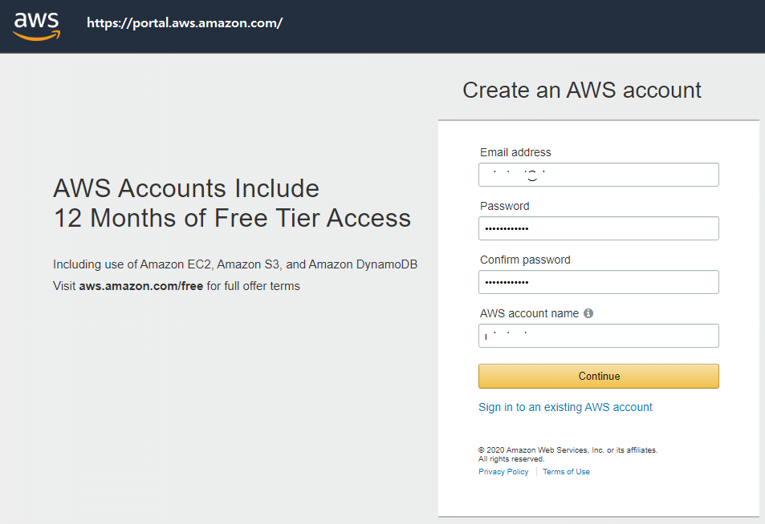

### ■ 신규 Lambda 만들기

- AWS에 로그인한 후, Lambda Management Console에 접속하여 함수를 생성한다.
- AWS 정책 템플릿에서 정책 `CloudWatch Logs`을 추가하여 새 역할을 생성한다.

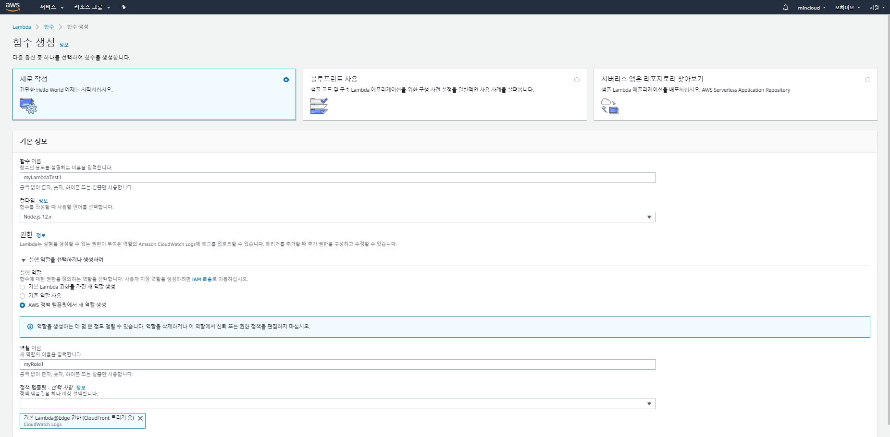

### ■ Lambda 관리하기

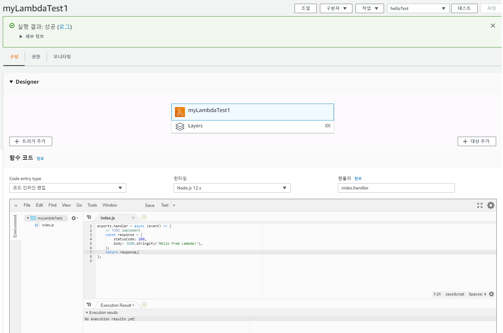

- 함수는 호출되면 ‘Hello from Lambda!’ 를 응답하도록 설정되어 있다. 페이지 상단의 테스트 버튼을 눌러 테스트 이벤트를 구성한 후, 이 함수를 테스트 합니다.

```js
exports.handler = async (event) => {
    // TODO implement
    const response = {
        statusCode: 200,
        body: JSON.stringify('Hello from Lambda!'),
    };
    return response;
};
```

- 다음과 같이 Response 정보 볼 수 있는데, 이렇게 만든 Lambda는, 따로 설정해주지 않으면 AWS 웹서비스, CLI로만 실행할 수 있다.

```js
Response:
{
  "statusCode": 200,
  "body": "\"Hello from Lambda!\""
}

Request ID:
"c7674760-25da-xxxx-8500-xxxxbf903e53"

Function Logs:
START RequestId: c7674760-25da-xxxx-8500-xxxxbf903e53 Version: $LATEST
END RequestId: c7674760-25da-xxxx-8500-xxxxbf903e53
REPORT RequestId: c7674760-25da-xxxx-8500-xxxxbf903e53	Duration: 1.74 ms	Billed Duration: 100 ms	Memory Size: 128 MB	Max Memory Used: 66 MB
```

### ■ Lambda에 HTTP 주소 부여하기

- 특정 주소로 요청이 오면 해당 함수가 실행되도록 설정을 해보자.
- `트리거 추가`를 눌러 `API Gateway`를 추가한다.
- 보안 부분에는 `열기`로 설정한다. 이는 해당 API 를 모두에게 열어 주겠다는 의미로 필요에 따라 보안 설정을 하여 권한이 있는 사람만 호출 할 수 있도록 설정 할 수도 있다.

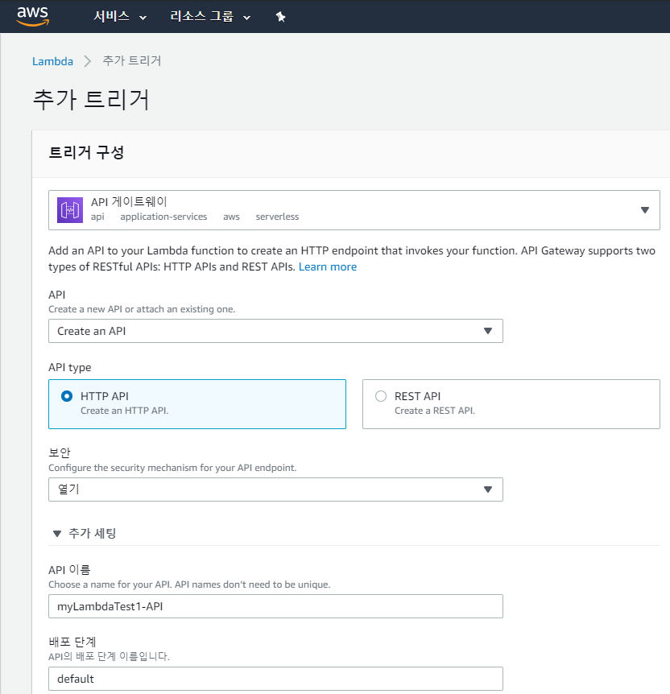

-  HTTP를 동해 응답을 받으려면, 콜백을 통해 응답하는 부분을 HTTP 응답 형식으로 바꿔주어야 한다.

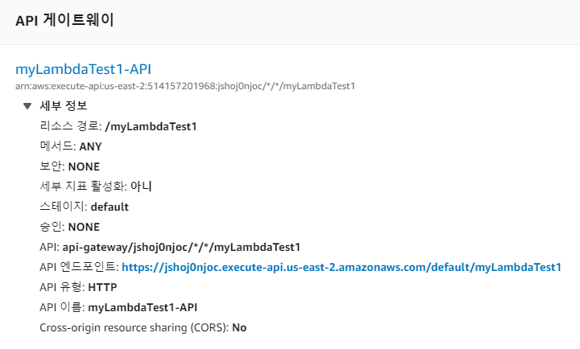

- Designer 부분에서 루트노드인 lambda 함수를 다시 클릭하여 함수 내용을 다음과 설정한 후 API 엔드포인트: https://jshoj0njoc.execute-api.us-east-2.amazonaws.com/default/myLambdaTest1 로 접근하면 broswer에서 접근이 가능하다.

```js
exports.handler = (event, context, callback) => {
    callback(null, {
        statusCode: 200,
        body: 'Hello from Lambda! from HTTP'
    });
};
```

---

## Serverless Framework로 Application 생성 및 배포하기

- AWS Lambda, Azure Functions, Google Cloud Functions로 serverless application을 만들때, 단순히 함수들을 작성하는 것 뿐만이 아니라 해당 애플리케이션에서 필요한 아키텍쳐들을 설정해 주어야하는데 Serverless를 사용하면 간단하게 애플리케이션을 만들고 배포할 수 있다.

### ■ Pre-requisites (Node.js, npm)

- Installation Serverless

```bash
$ npm install -g serverless
> serverless@1.67.3 postinstall
> node ./scripts/postinstall.js
   ┌───────────────────────────────────────────────────┐
   │                                                   │
   │   Serverless Framework successfully installed!    │
   │                                                   │
   │   To start your first project run 'serverless'.   │
   │                                                   │
   └───────────────────────────────────────────────────┘
$ sls --version
Framework Core: 1.67.3
Plugin: 3.6.6
SDK: 2.3.0
Components: 2.29.3
```

## Serverless Platform Login

- 다음 명령을 실행하며, https://dashboard.serverless.com 으로 자동 연결된다.

```bash
$ sls Login
Serverless: Logging you in via your default browser...
If your browser does not open automatically, please open it &  open the URL below to log in:
```

- you are creating a node.js rest api

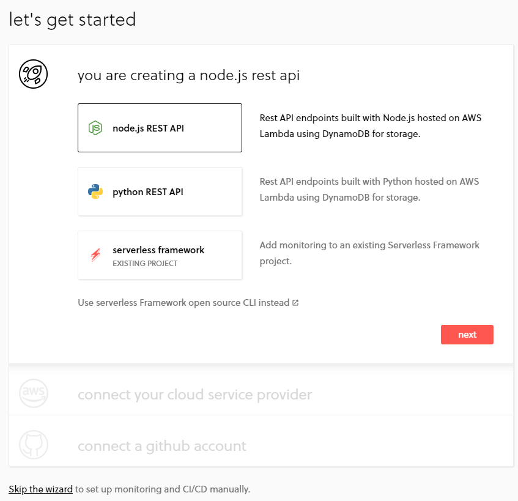

- connect your cloud service provider (Connect AWS)

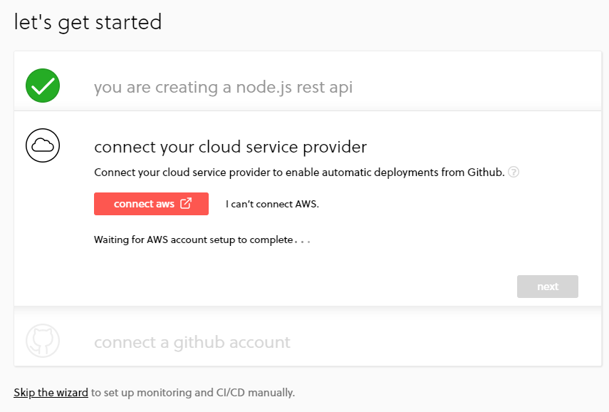

- AWS CloudFormation에서 빠른 스택 생성

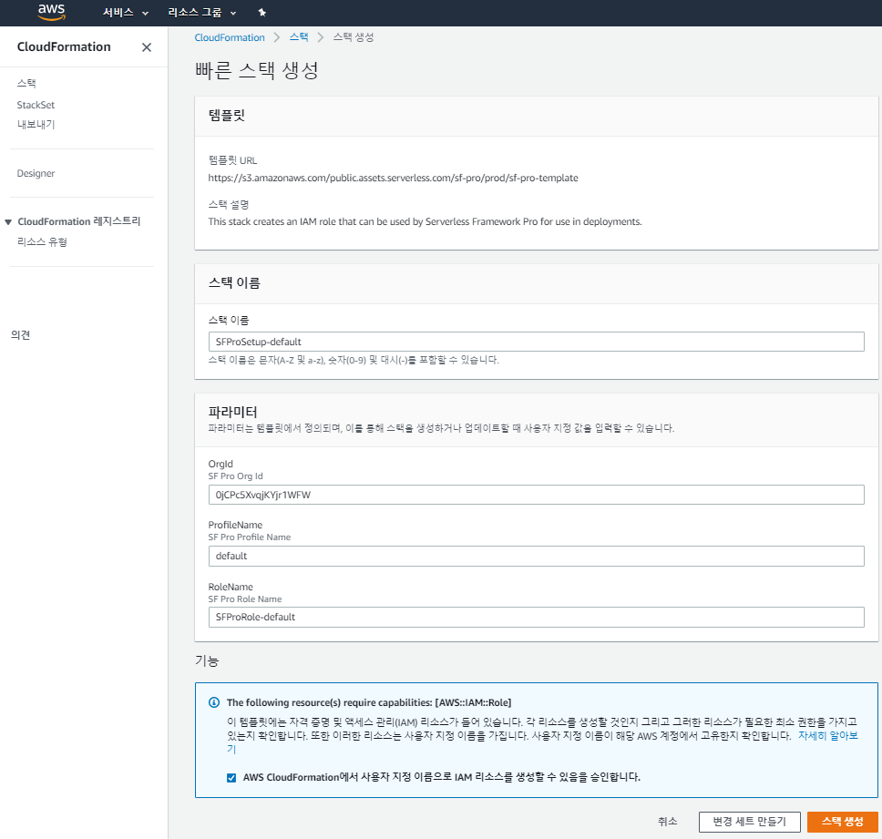

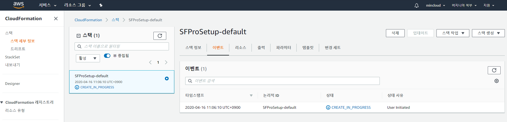

- connect a github account

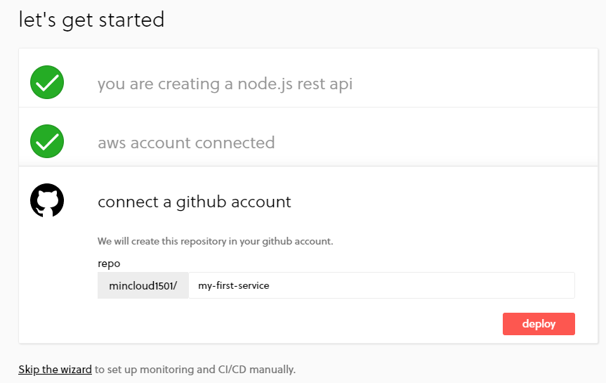

- new service Test

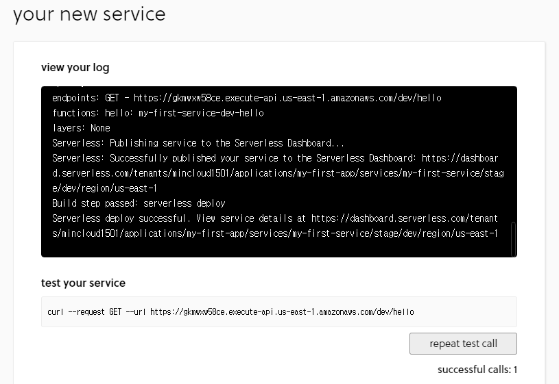

- monitoring

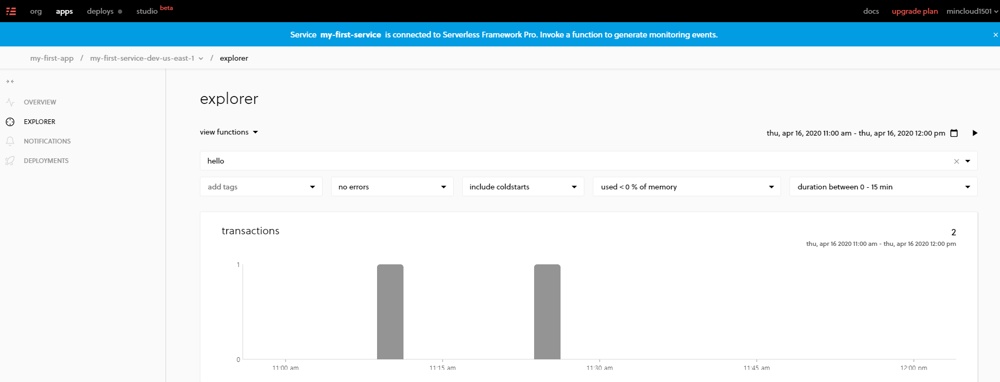

---

## AWS User 및 Credential 만들기

- Serverless framework를 통하여 AWS에 my application을 배포하기 위해, framework가 해당 작업을 진행해 줄 수 있도록 권한 설정을 해 주어야 한다.
- IAM에서 사용자 추가 메뉴에서 사용자 이름 입력 후 프로그래밍 방식 액세스를 선택한다.

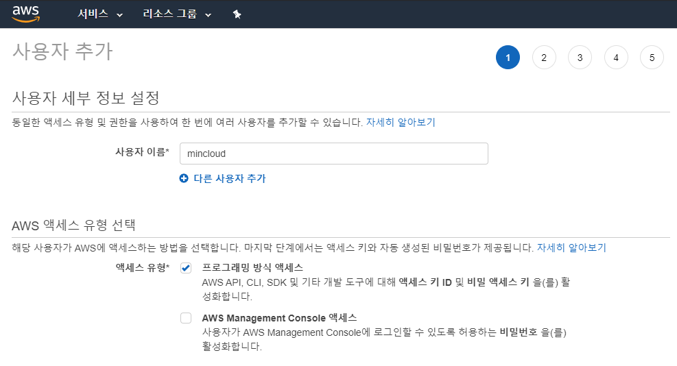

- 기존 정책에 직접 연결을 선택 후 `AdministratorAccess`, `AmazonAPIGatewayAdministrator`, `AWSLambdaBasicExecutionRole`, `AWSCloudFormationFullAccess` 등 필요한 권한들을 선택한다.

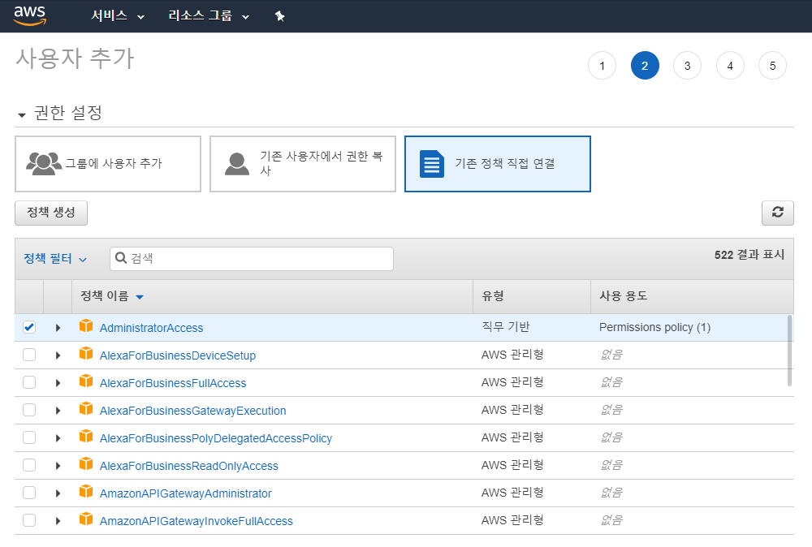

- Access Key ID 와 비밀 Access Key를 잘 기억하고, 노출되지 않도록 보안에 유의합니다.

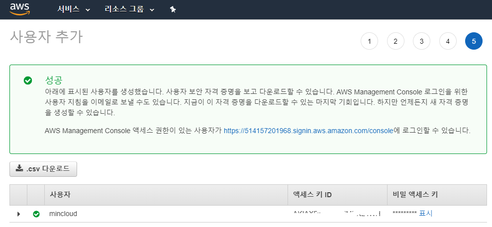

```bash
$ serverless config credentials --provider aws --key 액세스키ID --secret 비밀액세스키

Serverless: Setting up AWS...
```

---

## Serverless Template을 이용하여 Application 생성하기

```bash
$ sls create -t

Serverless: Generating boilerplate...

  Serverless Error ---------------------------------------

  Template "true" is not supported. Supported templates are:
       "aws-clojure-gradle", "aws-clojurescript-gradle", "aws-nodejs", "aws-nodejs-typescript", "aws-alexa-typescript", "aws-nodejs-ecma-script", "aws-python", "aws-python3"
       "aws-groovy-gradle", "aws-java-maven", "aws-java-gradle", "aws-kotlin-jvm-maven", "aws-kotlin-jvm-gradle", "aws-kotlin-nodejs-gradle", "aws-scala-sbt", "aws-csharp"
       "aws-fsharp", "aws-go", "aws-go-dep", "aws-go-mod", "aws-ruby", "aws-provided"
       "tencent-go", "tencent-nodejs", "tencent-python", "tencent-php"
       "azure-nodejs", "azure-nodejs-typescript", "azure-python"
       "cloudflare-workers", "cloudflare-workers-enterprise", "cloudflare-workers-rust"
       "fn-nodejs", "fn-go"
       "google-nodejs", "google-python", "google-go"
       "kubeless-python", "kubeless-nodejs"
       "knative-docker"
       "openwhisk-java-maven", "openwhisk-nodejs", "openwhisk-php", "openwhisk-python", "openwhisk-ruby", "openwhisk-swift"
       "spotinst-nodejs", "spotinst-python", "spotinst-ruby", "spotinst-java8"
       "twilio-nodejs"
       "aliyun-nodejs"
       "plugin"
       "hello-world".

  Get Support --------------------------------------------
     Docs:          docs.serverless.com
     Bugs:          github.com/serverless/serverless/issues
     Issues:        forum.serverless.com

  Your Environment Information ---------------------------
     Operating System:          win32
     Node Version:              12.14.0
     Framework Version:         1.67.3
     Plugin Version:            3.6.6
     SDK Version:               2.3.0
     Components Version:        2.29.3
```

- 위와 같이 `Serverless Error`가 발생하면, template 목록 중 `aws-nodejs`를 사용해 보자.

```bash
$ sls create -t aws-nodejs -p hello-serverless

Serverless: Generating boilerplate...
Serverless: Generating boilerplate in "~~~"
 _______                             __
|   _   .-----.----.--.--.-----.----|  .-----.-----.-----.
|   |___|  -__|   _|  |  |  -__|   _|  |  -__|__ --|__ --|
|____   |_____|__|  \___/|_____|__| |__|_____|_____|_____|
|   |   |             The Serverless Application Framework
|       |                           serverless.com, v1.67.3
 -------'

Serverless: Successfully generated boilerplate for template: "aws-nodejs"
```

- `hello-serverless` directory에 `handler.js` 파일과 `serverless.yml` 파일이 생성된다.

<handler.js>

```js
'use strict';

module.exports.hello = async event => {
  return {
    statusCode: 200,
    body: JSON.stringify(
      {
        message: 'Go Serverless v1.0! Your function executed successfully!',
        input: event,
      },
      null,
      2
    ),
  };

  // Use this code if you don't use the http event with the LAMBDA-PROXY integration
  // return { message: 'Go Serverless v1.0! Your function executed successfully!', event };
};
```

<server.yml>

```js
// 모든 주석 제외
service: hello-serverless

provider:
  name: aws
  runtime: nodejs12.x

functions:
  hello:
    handler: handler.hello
```

### `hello-serverless` directory에서 Function 호출하기

```bash
$ serverless invoke local --function hello

{
    "statusCode": 200,
    "body": "{\"message\":\"Go Serverless v1.0! Your function executed successfully!\",\"input\":\"\"}"
}
```

### serverless.yml 수정 후 배포하기

- `region`은 AWS에서 배포할 지역을 설정하는데, 기본으로 미국(`us-east-2`)으로 설정된다. (`ap-northeast-2`는 한국). `stage`는 현재 애플리케이션의 배포 상태를 의미하며 prod나 dev로 설정할 수 있다.
- 추가로 hello 함수에서 events 값을 추가하여 API Gatway와 연결한다.

```js
service: hello-serverless

provider:
  name: aws
  runtime: nodejs12.x
  stage: dev
  region: us-east-2

functions:
  hello:
    handler: handler.hello
    events: 
      - http:
          path: hello
          method: get
```

```bash
$ sls deploy

Serverless: Packaging service...
Serverless: Excluding development dependencies...
Serverless: Creating Stack...
Serverless: Checking Stack create progress...
........
Serverless: Stack create finished...
Serverless: Uploading CloudFormation file to S3...
Serverless: Uploading artifacts...
Serverless: Uploading service hello-serverless.zip file to S3 (389 B)...
Serverless: Validating template...
Serverless: Updating Stack...
Serverless: Checking Stack update progress...
..............................
Serverless: Stack update finished...
Service Information
service: hello-serverless
stage: dev
region: us-east-2
stack: hello-serverless-dev
resources: 11
api keys:
  None
endpoints:
  GET - https://jt7pzr1i7i.execute-api.us-east-2.amazonaws.com/dev/hello
functions:
  hello: hello-serverless-dev-hello
layers:
  None
Serverless: Run the "serverless" command to setup monitoring, troubleshooting and testing.
```

- https://jt7pzr1i7i.execute-api.us-east-2.amazonaws.com/dev/hello 에 접속하여 API Request를 확인한다.
- serverless.yml에서 수정 후 deploy한 `hello-serverless-dev-hello` 함수가 생성되어 있음을 확인할 수 있다.

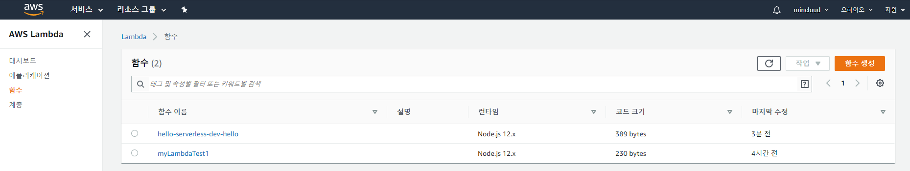