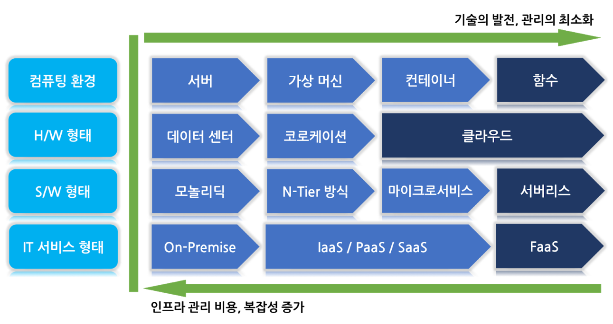

# Serverless


### IaaS (Infrastructure as a Service)

- AWS, Azure 등의 서비스가 만들어지기 시작하여 더 이상 서버자원, 네트워크, 전력 등의 인프라를 모두 직접 구축할 필요가 없어졌다. 이러한 `인프라를 가상화`하여 관리하기 쉽게 해주는 서비스 서비스를 통하여, 관리자 패널에서 인프라를 구성하고 사용하고. 사용자는 가상머신을 만들고, 네트워크를 설정하고, 하드웨어도 설정하고, 거기에 운영체제를 설치해서 애플리케이션을 구동할 수 있다. 또한 사용량을 쉽게 모니터링 할 수 있다.

### PaaS (Platform as a Service)

- IaaS 보다 더 추상화된 모델로써 `Network 및 Runtime 제공`이 된다. 사용자는 애플리케이션만 배포하면 바로 구동시킬 수 있는 서비스 이다. 대표적으로 AWS Elastic Beanstalk, Azure App Services 등이 있으며, 이를 사용하면 Auto Scaling 및 Load Balancing도 쉽게 적용 할 수 있다.


---

## ■ Serverless Concept

- Serverless는 IT Infra를 Data Center 또는 Cloud에 별도 준비 없이, 필요한 기능을 함수(function) 형태로 구현하고, Auto Scaling으로 자원 수요를 지원하며 전통적인 백엔드 대신 사용한다.



- Serverless는 Cloud 사업자가 운영하는 가상화된 컨테이너에서 실행된다. 미리 필요한 기능을 serverless에 원하는 programming language로 function 형태로 구현을 해두고, event driven 방식으로 필요에 따라 이 함수를 호출하여 사용한다.
- 초기의 serverless function은 script 형태의 언어인 `Node.js`만을 지원했지만 현재는 `Python`, `Javascript`, `C#`, `Java` 등의 대표적인 객체지향 프로그래밍 언어와, 자체 개발한 library package를 일반적으로 지원한다.
- Serverless Function은 또 다른 API를 호출하거나, 필요한 데이터를 데이터베이스에 저장 후 분석 작업 등을 할 수 있고, 동시 트랜잭션의 순차 처리를 위한 메시지큐나, 다른 클라우드 서비스와도 연계됳 수 있다.
- Serverless는 시스템 상의 다양한 이벤트를 함수의 형태로 처리하는 특징을 가지고 있기 때문에, IT 서비스 운영시 예상되는 반복적인 batch 처리 형태의 기능에 알맞다. 예를 들어, 반복적으로 타 시스템과 연계하여 비즈니스 요구사항에 맞는 결과를 가져오는 기능에 좀 더 특화되어 있다고 볼 수 있다.
- Serverless의 도입이 제일 알맞은 조직은 인프라에 대한 준비와 운영 인력을 최소화해야 하는 소규모 기술 인력으로, 비즈니스를 개발하여 빠르게 시장에 진입하는 스타트업 형태의 개발 조직에 알맞다고 볼 수 있다.

- Serverless는 서버가 없다는 의미로 보통 `Serverless Computing` 또는 `Serverless Architecture`로 불린다. Serverless 개념은 application 관점에서 `BaaS`와 `FaaS`로 나누어 살펴보면 이해가 더 용이하다.

[](https://martinfowler.com/articles/serverless.html)
[](https://hackernoon.com/what-is-serverless-architecture-what-are-its-pros-and-cons-cc4b804022e9)


### BaaS (Backend as a Service) - ex) Firebase

- 백엔드 서버 개발을 하다보면, 서버의 확장도 고려해야 하고, 보안성 또한 고려해야 하는데, 앱 개발에 있어서 필요한 다양한 기능들 (데이터베이스, 소셜서비스 연동, 파일시스템 등)을 API로 제공해 줌으로써, 개발자들이 서버 개발을 하지 않고서도 필요한 기능을 쉽고 빠르게 구현 할 수 있게 해주고, 비용은 사용 한 만큼 지불하는 형태의 서비스를 말한다.
- BaaS를 사용함으로서, 발생하는 대표적인 단점으로는 백엔드 로직들이 클라이언트쪽에 구현이 되며, 앱의 규모가 커질수록 비용이 들고, 복잡한 query가 불가능하다.

### FaaS (Function as a Service)


- FaaS는 프로젝트를 여러개의 함수로 쪼개서 (혹은 한개의 함수로 만들어서), 매우 거대하고 분산된 컴퓨팅 자원에 여러분이 준비해둔 함수를 등록하고, 이 함수들이 실행되는 횟수 (그리고 실행된 시간) 만큼 비용을 내는 방식을 말한다.
- 서버 시스템에 대해서 신경쓰지 않아도 된다는 점이 PaaS 와 유사하지만, PaaS 의 경우엔, `전체 Application`을 배포하며, 일단 어떠한 서버에서 애플리케이션이 24시간동안 계속 돌아가는 반면에
FaaS 는, application이 아닌 `함수(Function)`를 배포하며, 계속 실행되고 있는 것이 아닌 특정 이벤트가 발생 했을 때 실행되며, 실행이 되었다가 작업을 마치면 (또는 최대 timeout 시간을 지나면) 종료된다.

[장점]
- 함수가 호출된 만큼만 비용 지불한다.
- 인프라 구성 작업에 대해 신경 쓸 필요가 없다.
- 리눅스 업데이트, 취약점 보안패치 등에 대해 신경 쓸 필요가 없다.
- AWS의 Auto Scaling 같은 기술을 사용하여 다양한 트래픽에 유연한 대응이 가능하다.

[단점]
- 모든 코드를 함수로 쪼개서 작업하다 보니, 함수에서 사용할 수 있는 자원에 제한이 있다.
- FaaS 제공 업체에 강하게 의존할 수 밖에 없다.
- 함수들은 Stateless이기 때문에 로컬 데이터의 사용이 불가능하다. (AWS S2, Azure Storage 따로 사용하면 가능)

### Serverless 도입 유의 사항

```
1. 과금 방식의 이해와 예상 비용 산정
	- transaction이 별로 없는 유휴 시간이 많은 서비스의 경우 좀 더 경제적인 모델이 될 수 있으나, 함수의 컴퓨팅 자원 소모 비용에 대한 산정 필요
2. 조직 내 기술 내재화
	- Public Cloud에 대한 이해와 기술력이 충분한지 확인 (no-ops, less-ops) 및 신속한 application 개발 역량 필요
3. 성능 저하 대비책
	- Cold Start 방식의 함수 운용 방안 등 전반적인 응답 속도 개선에 대한 고민이 필요
4. 도입 서비스 순서 결정
	- 모든 백엔드 로직을 모두 serverless 환경으로 도입하기 보다는 단순 반복 처리를 위한 batch 작업 형태의 backend server logic, 빅데이터 분석, 머신러닝 등의 서비스를 우선 고려하는 것이 필요
5. Migration 방안
	- Cloud Vendor에 일부 종속성을 가지게 되는 부분에 대한 고민이 필요
```

---

## ■ Create Lambda & Test

### Pre-requisites (AWS Lambda)

- AWS account 생성 (https://portal.aws.amazon.com/)
- 결재정보 입력 : 확인 목적으로 1$ 결재 후, 몇일 지나면 자동 취소됨
- 2차 인증 처리 (Google OTP) : 해킹 등 보안을 목적으로 OTP 인증 절차 등록


### 신규 Lambda 만들기

- AWS에 로그인한 후, Lambda Management Console에 접속하여 함수를 생성한다.
- AWS 정책 템플릿에서 정책 `CloudWatch Logs`을 추가하여 새 역할을 생성한다.


### Lambda 관리하기


- 함수는 호출되면 ‘Hello from Lambda!’ 를 응답하도록 설정되어 있다. 페이지 상단의 테스트 버튼을 눌러 테스트 이벤트를 구성한 후, 이 함수를 테스트 합니다.

```js
exports.handler = async (event) => {
    // TODO implement
    const response = {
        statusCode: 200,
        body: JSON.stringify('Hello from Lambda!'),
    };
    return response;
};
```

- 다음과 같이 Response 정보 볼 수 있는데, 이렇게 만든 Lambda는, 따로 설정해주지 않으면 AWS 웹서비스, CLI로만 실행할 수 있다.

```js
Response:
{
  "statusCode": 200,
  "body": "\"Hello from Lambda!\""
}

Request ID:
"c7674760-25da-xxxx-8500-xxxxbf903e53"

Function Logs:
START RequestId: c7674760-25da-xxxx-8500-xxxxbf903e53 Version: $LATEST
END RequestId: c7674760-25da-xxxx-8500-xxxxbf903e53
REPORT RequestId: c7674760-25da-xxxx-8500-xxxxbf903e53	Duration: 1.74 ms	Billed Duration: 100 ms	Memory Size: 128 MB	Max Memory Used: 66 MB
```

### Lambda에 HTTP 주소 부여하기

- 특정 주소로 요청이 오면 해당 함수가 실행되도록 설정을 해보자.
- `트리거 추가`를 눌러 `API Gateway`를 추가한다.
- 보안 부분에는 `열기`로 설정한다. 이는 해당 API 를 모두에게 열어 주겠다는 의미로 필요에 따라 보안 설정을 하여 권한이 있는 사람만 호출 할 수 있도록 설정 할 수도 있다.


-  HTTP를 동해 응답을 받으려면, 콜백을 통해 응답하는 부분을 HTTP 응답 형식으로 바꿔주어야 한다.


- Designer 부분에서 루트노드인 lambda 함수를 다시 클릭하여 함수 내용을 다음과 설정한 후 API 엔드포인트: https://jshoj0njoc.execute-api.us-east-2.amazonaws.com/default/myLambdaTest1 로 접근하면 broswer에서 접근이 가능하다.

```js
exports.handler = (event, context, callback) => {
    callback(null, {
        statusCode: 200,
        body: 'Hello from Lambda! from HTTP'
    });
};
```

---

## ■ Serverless Framework로 Application 생성 및 배포하기

- AWS Lambda, Azure Functions, Google Cloud Functions로 serverless application을 만들 때, 단순히 함수들을 작성하는 것 뿐만이 아니라 해당 애플리케이션에서 필요한 아키텍쳐들을 설정해 주어야하는데 Serverless를 사용하면 간단하게 애플리케이션을 만들고 배포할 수 있다.

### Pre-requisites (Node.js, npm)

- Installation Serverless

```bash
$ npm install -g serverless
> serverless@1.67.3 postinstall
> node ./scripts/postinstall.js
   ┌───────────────────────────────────────────────────┐
   │                                                   │
   │   Serverless Framework successfully installed!    │
   │                                                   │
   │   To start your first project run 'serverless'.   │
   │                                                   │
   └───────────────────────────────────────────────────┘
$ sls --version
Framework Core: 1.67.3
Plugin: 3.6.6
SDK: 2.3.0
Components: 2.29.3
```

## ■ Serverless Platform Login

- 다음과 같은 Deploy Pipeline 설정이 가능하지만, 본 예제에서는 Serverless Platform을 사용한다.


- 다음 명령을 실행하면, https://dashboard.serverless.com 으로 자동 연결된다.

```bash
$ sls Login
Serverless: Logging you in via your default browser...
If your browser does not open automatically, please open it &  open the URL below to log in:
```

1. you are creating a node.js rest api


2. connect your cloud service provider (Connect AWS)


3. AWS CloudFormation에서 빠른 스택 생성


4. connect a github account


5. new service Test


6. monitoring


---

## ■ AWS User 및 Credential 만들기

- `Serverless Framework`를 통하여 AWS에 my application을 배포하기 위해, framework가 해당 작업을 진행해 줄 수 있도록 권한 설정을 해 주어야 한다.
- IAM에서 사용자 추가 메뉴에서 사용자 이름 입력 후 프로그래밍 방식 액세스를 선택한다.


- 기존 정책에 직접 연결을 선택 후 `AdministratorAccess`, `AmazonAPIGatewayAdministrator`, `AWSLambdaBasicExecutionRole`, `AWSCloudFormationFullAccess` 등 필요한 권한들을 선택한다.


- Access Key ID 와 비밀 Access Key를 잘 기억하고, 노출되지 않도록 보안에 유의한다. (.csv 파일 다운로드)


```bash
$ serverless config credentials --provider aws --key 액세스키ID --secret 비밀액세스키

Serverless: Setting up AWS...
```

---

## ■ Serverless Template을 이용하여 Application 생성하기

```bash
$ sls create -t

Serverless: Generating boilerplate...

  Serverless Error ---------------------------------------

  Template "true" is not supported. Supported templates are:
       "aws-clojure-gradle", "aws-clojurescript-gradle", "aws-nodejs", "aws-nodejs-typescript", "aws-alexa-typescript", "aws-nodejs-ecma-script", "aws-python", "aws-python3"
       "aws-groovy-gradle", "aws-java-maven", "aws-java-gradle", "aws-kotlin-jvm-maven", "aws-kotlin-jvm-gradle", "aws-kotlin-nodejs-gradle", "aws-scala-sbt", "aws-csharp"
       "aws-fsharp", "aws-go", "aws-go-dep", "aws-go-mod", "aws-ruby", "aws-provided"
       "tencent-go", "tencent-nodejs", "tencent-python", "tencent-php"
       "azure-nodejs", "azure-nodejs-typescript", "azure-python"
       "cloudflare-workers", "cloudflare-workers-enterprise", "cloudflare-workers-rust"
       "fn-nodejs", "fn-go"
       "google-nodejs", "google-python", "google-go"
       "kubeless-python", "kubeless-nodejs"
       "knative-docker"
       "openwhisk-java-maven", "openwhisk-nodejs", "openwhisk-php", "openwhisk-python", "openwhisk-ruby", "openwhisk-swift"
       "spotinst-nodejs", "spotinst-python", "spotinst-ruby", "spotinst-java8"
       "twilio-nodejs"
       "aliyun-nodejs"
       "plugin"
       "hello-world".

  Get Support --------------------------------------------
     Docs:          docs.serverless.com
     Bugs:          github.com/serverless/serverless/issues
     Issues:        forum.serverless.com

  Your Environment Information ---------------------------
     Operating System:          win32
     Node Version:              12.14.0
     Framework Version:         1.67.3
     Plugin Version:            3.6.6
     SDK Version:               2.3.0
     Components Version:        2.29.3
```

- 위와 같이 `Serverless Error`가 발생하면, template 목록 중 `aws-nodejs`를 사용해 보자.

```bash
$ sls create -t aws-nodejs -p hello-serverless

Serverless: Generating boilerplate...
Serverless: Generating boilerplate in "~~~"
 _______                             __
|   _   .-----.----.--.--.-----.----|  .-----.-----.-----.
|   |___|  -__|   _|  |  |  -__|   _|  |  -__|__ --|__ --|
|____   |_____|__|  \___/|_____|__| |__|_____|_____|_____|
|   |   |             The Serverless Application Framework
|       |                           serverless.com, v1.67.3
 -------'

Serverless: Successfully generated boilerplate for template: "aws-nodejs"
```

- `hello-serverless` directory에 `handler.js` 파일과 `serverless.yml` 파일이 생성된다.

<handler.js>

```js
'use strict';

module.exports.hello = async event => {
  return {
    statusCode: 200,
    body: JSON.stringify(
      {
        message: 'Go Serverless v1.0! Your function executed successfully!',
        input: event,
      },
      null,
      2
    ),
  };

  // Use this code if you don't use the http event with the LAMBDA-PROXY integration
  // return { message: 'Go Serverless v1.0! Your function executed successfully!', event };
};
```

<serverless.yml>

```js
// 모든 주석 제외
service: hello-serverless

provider:
  name: aws
  runtime: nodejs12.x

functions:
  hello:
    handler: handler.hello
```

### `hello-serverless` directory에서 Function 호출하기

```bash
$ serverless invoke local --function hello

{
    "statusCode": 200,
    "body": "{\"message\":\"Go Serverless v1.0! Your function executed successfully!\",\"input\":\"\"}"
}
```

### serverless.yml 수정 후 배포하기

- `region`은 AWS에서 배포할 지역을 설정하는데, 기본으로 미국(`us-east-2`)으로 설정된다. (`ap-northeast-2`는 한국). `stage`는 현재 애플리케이션의 배포 상태를 의미하며 prod나 dev로 설정할 수 있다.
- 추가로 hello 함수에서 events 값을 추가하여 API Gatway와 연결한다.

```js
service: hello-serverless

provider:
  name: aws
  runtime: nodejs12.x
  stage: dev
  region: us-east-2

functions:
  hello:
    handler: handler.hello
    events: 
      - http:
          path: hello
          method: get
```

```bash
$ sls deploy

Serverless: Packaging service...
Serverless: Excluding development dependencies...
Serverless: Creating Stack...
Serverless: Checking Stack create progress...
........
Serverless: Stack create finished...
Serverless: Uploading CloudFormation file to S3...
Serverless: Uploading artifacts...
Serverless: Uploading service hello-serverless.zip file to S3 (389 B)...
Serverless: Validating template...
Serverless: Updating Stack...
Serverless: Checking Stack update progress...
..............................
Serverless: Stack update finished...
Service Information
service: hello-serverless
stage: dev
region: us-east-2
stack: hello-serverless-dev
resources: 11
api keys:
  None
endpoints:
  GET - https://jt7pzr1i7i.execute-api.us-east-2.amazonaws.com/dev/hello
functions:
  hello: hello-serverless-dev-hello
layers:
  None
Serverless: Run the "serverless" command to setup monitoring, troubleshooting and testing.
```

- https://jt7pzr1i7i.execute-api.us-east-2.amazonaws.com/dev/hello 에 접속하여 API Request를 확인한다.
- serverless.yml에서 수정 후 deploy한 `hello-serverless-dev-hello` 함수가 생성되어 있음을 확인할 수 있다.


---

## ■ 여러 개의 함수 생성하기

- src 디렉토리에 Node.js기반 REST API 함수(books.js)를 생성한다.

<books.js>

```js
const createResponse = (status, body) => ({
  statusCode: status,
  body: JSON.stringify(body)
});

exports.createBook = (event, ctx, cb) => {
  cb(null, createResponse(200, { message: 'create' }));
};

exports.readBooks = (event, ctx, cb) => {
  cb(null, createResponse(200, { message: 'list' }));
};

exports.readBook = (event, ctx, cb) => {
  cb(null, createResponse(200, { message: 'read' }));
};

exports.updateBook = (event, ctx, cb) => {
  cb(null, createResponse(200, { message: 'update' }));
};

exports.deleteBook = (event, ctx, cb) => {
  cb(null, createResponse(200, { message: 'delete' }));
};
```

- serverless.yml을 수정하여 각 함수에 API 주소를 연결한다.

```js
service: hello-serverless

provider:
  name: aws
  runtime: nodejs12.x
  stage: dev
  region: us-east-2

functions:
  createBook:
    handler: src/books.createBook
    events:
      - http:
          path: books
          method: post
  readBooks:
    handler: src/books.readBooks
    events:
      - http:
          path: books
          method: get
  readBook:
    handler: src/books.readBook
    events:
      - http:
          path: books/{id}
          method: get
  updateBook:
    handler: src/books.updateBook
    events:
      - http:
          path: books/{id}
          method: patch
  deleteBook:
    handler: src/books.deleteBook
    events:
      - http:
          path: books/{id}
          method: delete
```

- 코드 저장 후, 생성한 여러 개 함수를 배포해 보자.

```bash
$ sls deploy

Serverless: Packaging service...
Serverless: Excluding development dependencies...
Serverless: Uploading CloudFormation file to S3...
Serverless: Uploading artifacts...
Serverless: Uploading service hello-serverless.zip file to S3 (701 B)...
Serverless: Validating template...
Serverless: Updating Stack...
Serverless: Checking Stack update progress...
....................................................................................................
Serverless: Stack update finished...
Service Information
service: hello-serverless
stage: dev
region: us-east-2
stack: hello-serverless-dev
resources: 32
api keys:
  None
endpoints:
  POST - https://jt7pzr1i7i.execute-api.us-east-2.amazonaws.com/dev/books
  GET - https://jt7pzr1i7i.execute-api.us-east-2.amazonaws.com/dev/books
  GET - https://jt7pzr1i7i.execute-api.us-east-2.amazonaws.com/dev/books/{id}
  PATCH - https://jt7pzr1i7i.execute-api.us-east-2.amazonaws.com/dev/books/{id}
  DELETE - https://jt7pzr1i7i.execute-api.us-east-2.amazonaws.com/dev/books/{id}
functions:
  createBook: hello-serverless-dev-createBook
  readBooks: hello-serverless-dev-readBooks
  readBook: hello-serverless-dev-readBook
  updateBook: hello-serverless-dev-updateBook
  deleteBook: hello-serverless-dev-deleteBook
layers:
  None
Serverless: Run the "serverless" command to setup monitoring, troubleshooting and testing.
```


### MongoDB용 Library 설치

- package.json 파일 생성 후, MongoDB ODM인 `mongoose` Library를 설치한다.

```bash
$ npm init
$ npm i --save mongoose

npm notice created a lockfile as package-lock.json. You should commit this file.
npm WARN hello-serverless@1.0.0 No description
npm WARN hello-serverless@1.0.0 No repository field.

+ mongoose@5.9.9
added 30 packages from 18 contributors and audited 38 packages in 5.056s

1 package is looking for funding
  run `npm fund` for details

found 0 vulnerabilities
```

### mLab에서 mongoDB.Atlas로 Cluster 추가하기 [](https://mlab.com/)

- DaaS(Database-as-a-Service) 업체인 mlab에 접속하여, sing up/in후 free 500MB 선택하여 `Build a New Cluster` 실행


### Book Model 만들고 mongoose 연결하기

- DB Schema를 위한 model을 정의하여 `books.js`에서 연결한다.

<book.js>

```js
const mongoose = require('mongoose');

const StorySchema = new mongoose.Schema({
  title: String,
  body: String
});

const Book = mongoose.model('Book', BookSchema);

module.exports = Book;
```

- mongoose 연결을 위한 URI를 복사하여 `books.js`에 붙여 넣는다.


<books.js>

```js
const mongoose = require('mongoose');
const Book = require('./book');

const connect = () => {
  return mongoose.connect('mongodb+srv://mincloud:<password>@cluster0-i1dcg.mongodb.net/test?retryWrites=true&w=majority');
};

const createResponse = (status, body) => ({
  statusCode: status,
  body: JSON.stringify(body)
});

exports.createBook = (event, ctx, cb) => {
  ctx.callbackWaitsForEmptyEventLoop = false;
  const { title, body } = JSON.parse(event.body);
  connect().then(
    () => {
      const book = new Book({ title, body });
      return book.save();
    }
  ).then(
    story => {
      cb(null, createResponse(200, Book));
    }
  ).catch(
    e => cb(e)
  );
};
```

- `sls deploy`하여 aws의 function `hello-serverless-dev-createBook`에서 이벤트 테스트를 수행하여 정상 여부를 확인한다.


- 해당 결과는 Postman을 통해서도 확인해 볼 수 있다.


- mongoDB.Atlas에서 DB Status에 대해 종합적으로 모니터링이 가능하다.


### 다른 함수들 테스트

- [createBook] POST https://jt7pzr1i7i.execute-api.us-east-2.amazonaws.com/dev/books

```json
{
  "title": "제목",
  "body": "내용"
}
```

- [readBooks] GET https://jt7pzr1i7i.execute-api.us-east-2.amazonaws.com/dev/books/
- [readBook]  GET https://jt7pzr1i7i.execute-api.us-east-2.amazonaws.com/dev/books/5e9d607040d46e0007d247db
- [deleteBook] DELETE https://jt7pzr1i7i.execute-api.us-east-2.amazonaws.com/dev/books/5e9d607040d46e0007d247db

---

## ■ AWS Lambda 모니터링

- AWS Lambda Monitoring을 위해 대시보드 선택 (`AWS Lambda`,`Amazon API Gateway`,`Amazon S3`)하여, 아래 Metric들의 모니터링이 가능하다.
	- `Invocations` : 5분 기간 동안 함수가 호출된 횟수입니다.
	- `Duration` : 평균, 최소, 최대 실행 시간입니다.
	- `오류 수 및 성공률(%)` : 오류 수 및 오류 없이 완료된 실행의 비율입니다.
	- `Throttles` : 동시성 한도로 인해 실행에 실패한 횟수입니다.
	- `IteratorAge` : 스트림 이벤트 소스에서 Lambda가 배치의 마지막 항목을 받아 함수를 호출했을 때 해당 항목의 수명입니다.
	- `Async delivery failures(비동기 전송 실패)` : Lambda가 대상 또는 배달 못한 편지 대기열에 쓰려고 할 때 발생한 오류의 개수입니다.
	- `Concurrent executions(동시 실행)` : 이벤트를 처리 중인 함수 인스턴스의 개수입니다.


- 또한, `CloudWatch Logs` 정책 추가를 통해 CloudWatch 모니터링 형태도 가능하다.
- Lambda은 사용자의 함수에 주어진 권한을 사용하여 로그를 CloudWatch Logs에 업로드 하며, 콘솔에서 로그가 보이지 않으면 실행 역할 권한을 확인해야 한다.


## ■ AWS X-Ray 사용 (Google Cloud Stack Driver Trace와 유사 기능)

- AWS X-Ray를 사용하여 애플리케이션의 구성 요소를 시각화하고, 성능 병목 현상을 식별하고, 오류가 발생한 요청을 문제 해결할 수 있다.
- Lambda 함수는 추적 데이터를 X-Ray로 보내고, X-Ray는 데이터를 처리하여 서비스 맵과 검색 가능한 추적 요약을 생성한다.

- AWS X-Ray를 사용하기 위해서는 함수에 추적 데이터를 X-Ray로 업로드할 권한이 있어야 한다.
- Lambda 콘솔에서 적극 추적을 활성화하면 Lambda가 필요한 권한을 함수의 실행 역할에 추가해 준다. 그렇지 않으면 실행 역할에 `AWSXRayDaemonWriteAccess` 정책을 추가해야 한다.
	- X-Ray는 여전히 애플리케이션이 처리하는 요청에 대한 대표 샘플을 제공하면서 트레이스가 효율적일 수 있도록 샘플링 알고리즘을 적용한다.
	- 기본 샘플링 규칙은 초당 요청이 1개이며 추가 요청의 5% 이다.

### [설정 방법]

- 추적 헤더가 없는 요청을 추적하려면 함수의 구성에서 적극 추적을 활성화하면 된다. 이후 `저장` 필수
	- 함수 트레이스 기능을 활성화할 때 AWS Lambda에서 자동으로 X-Ray 데몬을 실행한다.


- X-Ray가 설정된 전체 서비스 맵 및 서비스별 세부정보를 확인할 수 있다.


- 설정된 해당 함수의 X-Ray 트레이스를 확인할 수 있다.


- 각 트레이스별 타임라인도 상세 확인이 가능하다.


---

# ■ Amazon DynamoDB 활용하기 [](https://docs.aws.amazon.com/ko_kr/amazondynamodb/latest/developerguide/Introduction.html)

- 본 실습에서는 Visual Studio Code를 사용하여 Node.js를 기반으로 AWS 자습서 code를 실습해 봅니다.

### Pre-requisites (AWS DynamoDB)

1. 1단계: 자격 증명 구성 (앞 단계에서 수행하여 pass)
2. 2단계: 프로젝트용 패키지 JSON 생성 (해당 디렉토리에 package.json 파일 생성)

```bash
$ npm init
```

3. 3단계: SDK 및 종속성 설치

```bash
$ npm install aws-sdk

+ aws-sdk@2.661.0
added 14 packages from 66 contributors and audited 17 packages in 18.417s
found 0 vulnerabilities
```
#### Create Table

- Amazon DynamoDB Endpoint 설정 : `AWS.config.update({endpoint: "https://dynamodb.aws-region.amazonaws.com"});`

<MoviesCreateTable.js>

```js
var AWS = require("aws-sdk");

AWS.config.update({
  region: "us-east-2",
  endpoint: "https://dynamodb.us-east-2.amazonaws.com"
});

var dynamodb = new AWS.DynamoDB();

var params = {
    TableName : "Movies",
    KeySchema: [       
        { AttributeName: "year", KeyType: "HASH"},  //Partition key
        { AttributeName: "title", KeyType: "RANGE" }  //Sort key
    ],
    AttributeDefinitions: [       
        { AttributeName: "year", AttributeType: "N" },
        { AttributeName: "title", AttributeType: "S" }
    ],
    ProvisionedThroughput: {       
        ReadCapacityUnits: 10, 
        WriteCapacityUnits: 10
    }
};

dynamodb.createTable(params, function(err, data) {
    if (err) {
        console.error("Unable to create table. Error JSON:", JSON.stringify(err, null, 2));
    } else {
        console.log("Created table. Table description JSON:", JSON.stringify(data, null, 2));
    }
});
```
- 생성 코드 실행

```js
$ node MoviesCreateTable.js

Created table. Table description JSON: {
  "TableDescription": {
    "AttributeDefinitions": [
      {
        "AttributeName": "title",
        "AttributeType": "S"
      },
      {
        "AttributeName": "year",
        "AttributeType": "N"
      }
    ],
    "TableName": "Movies",
    "KeySchema": [
      {
        "AttributeName": "year",
        "KeyType": "HASH"
      },
      {
        "AttributeName": "title",
        "KeyType": "RANGE"
      }
    ],
    "TableStatus": "CREATING",
    "CreationDateTime": "2020-04-23T02:08:12.680Z",
    "ProvisionedThroughput": {
      "NumberOfDecreasesToday": 0,
      "ReadCapacityUnits": 10,
      "WriteCapacityUnits": 10
    },
    "TableSizeBytes": 0,
    "ItemCount": 0,
    "TableArn": "arn:aws:dynamodb:us-east-2:514157201968:table/Movies",
    "TableId": "f24a989f-8e61-4012-9a25-80b00de27618"
  }
}
```


- 샘플 데이터 업로드 (moviedata.json, MoviesLoadData.js)

---

### AWS Lambda Application 및 Function 생성 (using dynamoDB)

- `dynamodb-doc`이라는 라이브러리를 이용하면 간단히 DynamoDB와 통신할 수 있다.

```bash
$ npm init
$ npm install dynamodb-doc

+ dynamodb-doc@1.0.0
added 1 package from 3 contributors and audited 35 packages in 1.67s
found 0 vulnerabilities
```

```bash
$ sls create -t aws-nodejs -p dynamodb-serverless
```
- IAM Management Console에서 해당 사용자에 `AWSLambdaBasicExecutionRole` 권한 및 getItem에 DynamoDB Read권한을 추가한다.


- 특정 주소로 요청이 오면 해당 함수가 실행되도록 `트리거 추가`를 눌러 `API Gateway`를 추가한다.


- `serverless.yml` 편집

```js
service: dynamodb-serverless

provider:
  name: aws
  runtime: nodejs12.x

  stage: dev
  region: us-east-2

  iamRoleStatements:
    - Effect: "Allow"
      Action:
        - dynamodb:Query
        - dynamodb:Scan
        - dynamodb:GetItem
        - dynamodb:PutItem
        - dynamodb:UpdateItem
        - dynamodb:DeleteItem
      Resource: "arn:aws:dynamodb:${opt:region, self:provider.region}:*:table/${self:provider.environment.DYNAMODB_TABLE}"

  environment:
    DYNAMODB_TABLE: Movies

functions:
  readMovie:
    handler: src/movies.readMovie
    events:
      - http:
          path: movies
          method: get
```

```bash
$dynamodb-serverless$ sls deploy
```

- 테스트 이벤트 `readMovie` 생성하여 테스트를 수행해 본다.

